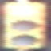
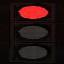

# System Integration Project

The goal of this project was to incorporate several of the course's topics into one single project. A car will follow given line of points that are already available for the track. A fixed amount of waypoints will be chosen as the next ones, while assigning a velocity to each one. Gas, brake and steering have to be controlled accordingly in order to keep the car on the track. Camera images have to be used to detect traffic lights and their state. Depending on the state, the car has to come to a stop at the corresponding stop line (the positions of all stop lines on the track are known) and then start driving again, as soon as the traffic light switches to green.

## 1. Waypoint updater
The waypoint updater knows all available waypoints of the current track. It will choose the next 50 waypoints for the car to follow. If no traffic light is being detected, the desired velocity is set to each waypoint. The desired velocity has been set to 30 Mph by default. If a red or yellow traffic light is being detected, the velocities of the waypoints between the car's current position and the traffic light's stop line are constantly reduced starting from current velocity until 0. As long as no green traffic light has been detected, no more waypoint updates will happen, in order to keep the car in standstill at the stop line.

## 2. Gas, brake and steering
For the gas, a PI controller and for the brake, a simple P controller with following values are being used:
- Gas: P=0.04, I=0.01, Max=0.4
- Brake: P=150, Max=500

The provided formula for calculating the maximum allowed braking torque for a given maximum deceleration produced an output of more then 2000 Nm, which was way too high. Because of this, the maximum brake torque has been set to a hardcoded value of 500 Nm. If the current velocity is below a certain threshold and the target velocity is 0, the a brake value of 1000 Nm is applied to ensure the stillstand of the car. For the steering, the provided yaw controller is being used. Multiplying the controller result by 2 is the only modification. Again, no steering will happen if the current velocity is below a certain threshold.

## 3. Traffic light detection
The traffic light detection uses a Tensorflow model for categorization of the light states green, yellow and red. If no traffic light could be detected, a forth classification for "Unknown" will be returned. The same model as in the "Traffic vehicle detection and tracking" project was used:

|Layer        |Description                                                |
| ----------- | --------------------------------------------------------- |
|Lambda       | Input: 64x64x3, Normalizes the images from -0.5 to 0.5    |
|Convolution2D| Filters: 24, Kernel: 5x5, Subsample: 2x2, Activation: Relu|
|Convolution2D| Filters: 36, Kernel: 5x5, Subsample: 2x2, Activation: Relu|
|Convolution2D| Filters: 48, Kernel: 5x5, Subsample: 2x2, Activation: Relu|
|Dropout      | Keeping probability: 0.5                                  |
|Convolution2D| Filters: 64, Kernel: 3x3, Activation: Relu                |
|Convolution2D| Filters: 64, Kernel: 3x3, Activation: Relu                |
|Dropout      | Keeping probability: 0.5                                  |
|Flatten      | Flattens the data to a one-dimensional array              |
|Dense        | Output: 100                                               |
|Dense        | Output: 50                                                |
|Dense        | Output: 10                                                |
|Dense        | Output: 4                                                 |

Two significant changes to the vehicle detection project can be observed:
- A dataset for training the algorithm is not available
- The algorithm has to run in realtime

### 3.1 Training data
To collect data for training the model, a small ROS subscriber was implemented, that listens to the "/image_color" topic (tl_detector/light_classification/image_recorder.py). For the simulation part, a test drive within the simulator was performed. For the "real" part, the provided ROS bag with camera images from the test site has been played. Every 10th image was recorded for further investigation. The Windows tool "LabelImg" (https://github.com/tzutalin/labelImg) was used to generate labels for each image. A C# application for cutting the images according to labels has been developed. For each labeled image, it will blur, erode and change the brightness in order to make the model more robust and to prevent underfitting. It automatically cuts out regions from the remaining image and labels them as "Unknown". The application can be found in "tl_detector/light_classification/training/ImageCut". The training data can be found in "tl_detector/light_classification/training", the folder has two subfolders "real" and "simulation". Within each folder, the "source" folder contains the images and labels used as input for the ImageCut application and the "processed" contains the cut images as well as a single file that contains all labels. After training the model (tl_detector/light_classification/model_training.py), a h5-file will be stored in either "real" or "simulation", depending on the current training data input. Below you can see a source input image and a subset of the corresponding output.

### 3.2 The detection algorithm
As running a sliding window search across the whole image is not feasible to be run in realtime, a different approach has been chosen:

- Preprocess image
- Perform a simple blob detection to get keypoints (i.e. the dark spots of a traffic light)
- Search for keypoints that have a very small horizontal deviation
    - Simulation: Find 3 keypoints
    - Real: Find 2 keypoints
- For each set of associated keypoints: Calculate the traffic light size by multiplying the vertical distance of the keypoints by constant factors
- Perform object prediction by using the trained model
    - Simulation: There will be no other occurence of three dark spots in a column, the calculated window can be directly given to the model
    - Real: Two windows will be calculated, one for the red/green state and one for yellow state

The details of the algorithm will be explained in the subsequent chapters.

#### 3.2.1 Image preprocessing
For the real scenario, only the upper half of the image is taken, no traffic light will ever occur in the lower part of the image. The camera of the simulated car is mounted differently, thus the whole image needs to be taken there. Then, the image brightness gets changed to either strenghten or weaken the dark spots. For the simulation, the brightness will always be increased by a fixed amount to filter out dark spots like branches of trees. For the real scenario, a variable amount will be deducted, depending on the average image brightness and some other factors. The simulation algorithm will now apply a Gauß filter to smoothen the image (this leads to better performance within the simulator only). As a last step, the image is being converted to grayscale, as the blob detector expects this format as input. Below you can see example images from both the real and simulator scenario after applying the described steps.

Input image

Cutting and darkening

Converting to grayscale

#### 3.2.2 Blob detection
The OpenCV simple blob detector is being applied to find out the dark spots in the image. This helps to narrow down the possible locations of traffic lights. For both the real and simulation scenario, different parameters for the blob detector have been used. The simulation detector, for example, expects nearly circular blobs, while the real detector accepts almost arbitrary shapes. Below you can find two example images for the blob (i.e. keypoints) detection (blue crosses).

Blob detection executed on a real image

Blob detection executed on a simulation image

#### 3.2.3 Filtering out possible traffic lights
The next task is to find keypoints that are aligned vertically underneath each other, in order to further narrow down the possible traffic lights. If two (or three, for the simulator), keypoints exhibit a very small horizontal deviation, they will be taken into account. For the simulation, the red/yellow/green color will also be detected as keypoint. Thus, by multiplying with certain factors, the exact size of the traffic light can be calculated. Only this single window is required. For the real scenario, the light bulb of the traffic light will be very bright, meaning it will not be detected as a keypoint. Therefore, two sizes for the traffic light have to be calculated: One for the case that the two dark spots are directly underneath each other, and another one for the case that there is the yellow light inbetween.

#### 3.2.4 Performing object prediction
As already mentioned, there is only one defined rectangle for a traffic light in the simulation algorithm (there will be always three traffic lights in a row, only the first detected one will be evaluated). The traffic light gets cut out of the image and is resized to fit the model input requirements. For the real algorithm, two windows have to be created, as already mentioned above. The window position has to be chosen according to the most likely state of the potential traffic light. Therefore, a patch with the approximate size of the light bulb is placed once above the two keypoints and once below them. The average brightnesses of the image underneath the patches are evaluated. The brighter patch is more likely to be the light bulb. This way, the window can be placed exactly at the (assumed) traffic light's position. As the blob detector might detect structures that will look like traffic lights (i.e. two dark and one bright spot underneath each other), the object prediction is still required. This whole process will happen for each detected pair of vertically aligned keypoints. Both the simulation and the real traffic light detection will return the red state for both red and yellow traffic lights, as the remaining time until switching from yellow to red is unknown. The car could be already too close to the traffic light to brake accordingly when the switching happens.

